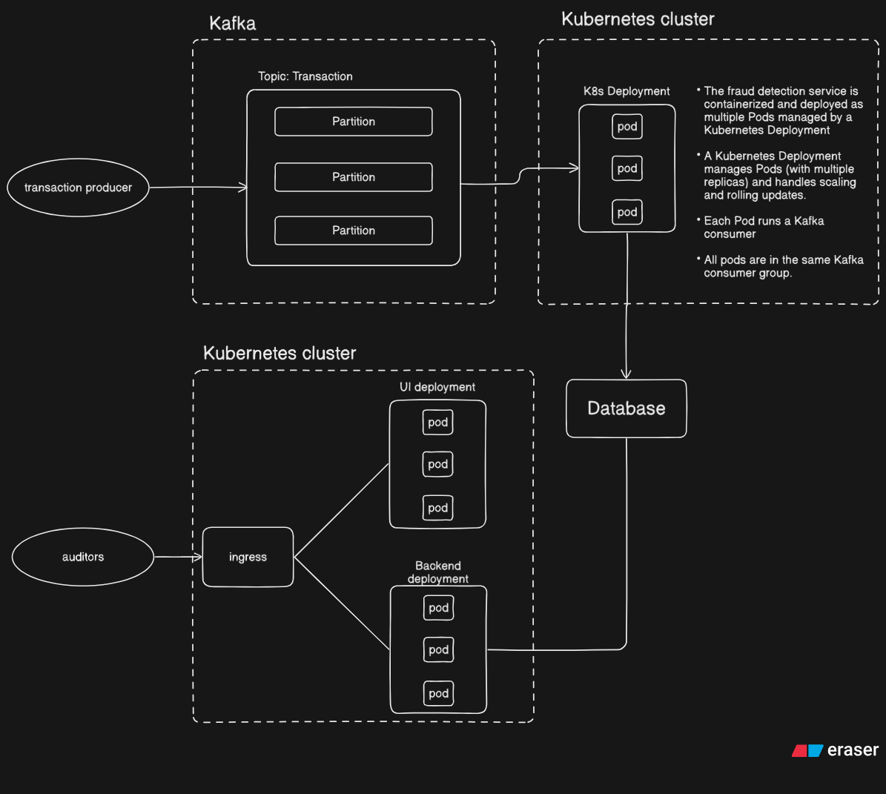

# Fraud Detection FastAPI Service

**Architecture exaplination:**
This FastAPI-based web service detects fraudulent financial transactions using a pre-trained machine learning model. At startup, it loads the model and scaler to enable fast inference. The application offers RESTful endpoints for predicting fraud and retrieving past predictions, which are stored in a local SQLite database. It includes unit tests for the API endpoints and supports Docker for easy deployment.


**Architecture diagram:**



## Requirements

- Python 3.10+
- Docker (optional)

## Running the EDA and training

1. Put the dataset  (`fraud_mock.csv`) in the `data/` folder. So that the file path should be `data/fraud_mock.csv`.
2. Create a Python3.10 virtual environment and install the dependencies:
   ```sh
   python3.10 -m venv .venv
   source .venv/bin/activate
   pip install -r requirements.txt
   ```
2. Run the `notebooks/EDA.ipynb` to perform EDA
3. Run the `notebooks/train.ipynb` to perform feature engineering, model training, parameter tuning, and saving the model.

## Running the FastAPI App


### (option 1) with Docker

1. **Build the Docker image:**
   ```sh
   docker build -t fraud-api-sam .
   ```

2. **Run the container:**
   ```sh
   docker run -p 8080:8080 fraud-api-sam
   ```

Or using the provided script:
```sh
bash run_docker.sh
```
- The API will be available at [http://localhost:8080](http://localhost:8080)
- The documentation can be accessed at [http://localhost:8080/docs](http://localhost:8080/docs)

### (option 2) with Python's virtual environment

1. **Create a Python3.10 venv and install dependencies (if not done already)**
    ```sh
    python3.10 -m venv .venv
    source .venv/bin/activate
    pip install -r requirements.txt
    ```
2. **Run the FastAPI app:**
    ```sh
    fastapi run src/main.py --port 8080
    ```

- The API will be available at [http://localhost:8080](http://localhost:8080)
- The documentation can be accessed at [http://localhost:8080/docs](http://localhost:8080/docs)

> Note: if you first run the Docker, the database will be created in the `output/` folder as readonly (written by the container). If you later run the FastAPI app without Docker and use the same database, you will need to change the permissions of the `output/` folder to allow writing:
```sh
sudo chmod -R 777 output/
```

## API Endpoints

The endpoints can be tested directly at [http://localhost:8080/docs](http://localhost:8080/docs)

### POST `/predict`

Predict if a transaction is fraudulent.

**Request Body Example:**
```json
{
    "time_ind": 1, 
    "transac_type": "TRANSFER", 
    "amount": 181.0, 
    "src_acc": "acc1796908", 
    "src_bal": 181.0, 
    "src_new_bal": 0.0, 
    "dst_acc": "acc4938640", 
    "dst_bal": 0.0, 
    "dst_new_bal": 0.0
}

```

**Response Example:**
```json
{
  "pred": true,
  "pred_proba": 1
}
```

### GET `/frauds`

Retrieve all transactions previously predicted as fraudulent.

**Query Parameters:**
- `proba_threshold` (optional): Only return frauds with probability above this threshold.

**Response Example:**
```json
[
  {
    "pred": true,
    "pred_proba": 1,
    "time_ind": 1,
    ...
    "timestamp": "2025-08-01T07:38:29.450325",
    "model_version": "models/model.pkl",
    "scaler_version": "models/scaler.pkl"
  },
  {
    "pred": true,
    "pred_proba": 1,
    "time_ind": 1,
    ...
    "timestamp": "2025-08-01T07:38:41.991734",
    "model_version": "models/model.pkl",
    "scaler_version": "models/scaler.pkl"
  }
]
```

## Testing

Run all tests using:

```sh
bash test.sh
```

Or directly with pytest:

```sh
db_url='sqlite:///output/test.db' pytest test.py -svv
```

## Configuration

To adjust configuration, modify the `config.py` file or override with a `.env` file.
